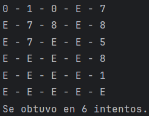

# PARTE 1 - VariablesCondiciones
```java
public static String numerosMultiplos(int n1, int n2) {

    System.out.print("Introduce un número: ");
    n1 = entradaEscaner.nextInt();
    System.out.print("Introduce otro número: ");
    n2 = entradaEscaner.nextInt();

    return n1 % n2 == 0 ? "Son múltiplos" : "No son múltiplos";
}
```
# PARTE 2 - CondicionalesBucles
```java
import java.util.ArrayList;

public class CondicionalesBucles {
    private static int puntuacion, aleatorio, usuario;
    private static String respuestaReinicio;
    private static ArrayList<Integer> utilizados = new ArrayList<>();

    // juego de adivinar el numero
    public static void adivina() {
        aleatorio = (int) ((Math.random() * 100) + 1);
        puntuacion = 10;
        utilizados.clear();

        logicaJuego();
    }

    public static void logicaJuego() {
        // comienza el juego pidiendo un número
        System.out.println("Hola mi nombre es Junlia, ¿Quieres adivinar el número que estoy pensando?.\nTienes 10 intentos.\nIntroduce un número entre el 1 y 100: ");
        usuario = Main.entradaEscaner.nextInt();

        while (usuario != aleatorio) {
            // si esta aqui NO lo adivinado y dice si es mayor o menor
            System.out.println("CASIIIIII!!!!");
            if (usuario < aleatorio) System.out.println("Tu número es más bajo.");
            else System.out.println("Tu número es más alto.");
            System.out.println("--------------------");

            // resta intentos y almacena en numeros utilizados
            puntuacion--;
            utilizados.add(usuario);

            // imprime informacion
            System.out.println("NUMEROS UTILIZADOS: ");
            for (int n : utilizados) {
                System.out.print(" - " + n);
            }

            if (puntuacion != 0) {
                System.out.println("\n--------------------");
                System.out.println("Te quedan " + puntuacion + " intentos");
                System.out.println("--------------------");

                // volver a intentar
                System.out.println("Introduce un número entre el 1 y 100: ");
                usuario = Main.entradaEscaner.nextInt();
            } else {
                System.out.println("\n------------------- Lo siento has perdido!!! --------------------\nHasta pronto.");
                System.exit(0);
            }
        }

        System.out.println("------------------- Enorabuena has ganado!!! -------------------\n¿Quieres jugar otra vez? (SI/NO)");
        respuestaReinicio = Main.entradaEscaner.next();
        if (respuestaReinicio.equalsIgnoreCase("si")) {
            System.out.println("\n\n\n\n\n\n\n\n\n\n\n\n\n\n\n\n");
            adivina();
        } else {
            System.out.println("Hasta pronto.");
            System.exit(0);
        }
    }

}

```


# PARTE 3 - BuclesAnidados 
```java
import java.security.SecureRandom;
import java.util.Objects;

public class BuclesAnidados {
    //    Necesitamos mostrar un contador con 5 dígitos (X-X-X-X-X), que muestre los números del 0-0-0-0-0 al 9-9-9-9-9, con la particularidad que cada vez que aparezca un 3 lo sustituya por una E.
    private static String cont1;
    private static String cont2;
    private static String cont3;
    private static String cont4;
    private static String cont5;
    private static final SecureRandom SECURE = new SecureRandom();
    static int cont = 0;
    
    public static void contador() {
        try {
            // bucle principal va a funcionar hasta que todas "E"
            do {
                if (!Objects.equals(cont1, "E")) cont1 = cifraLetra(generaAlea(9));
                if (!Objects.equals(cont2, "E")) cont2 = cifraLetra(generaAlea(9));
                if (!Objects.equals(cont3, "E")) cont3 = cifraLetra(generaAlea(9));
                if (!Objects.equals(cont4, "E")) cont4 = cifraLetra(generaAlea(9));
                if (!Objects.equals(cont5, "E")) cont5 = cifraLetra(generaAlea(9));

                System.out.println(cont1 + " - " + cont2 + " - " + cont3 + " - " + cont4 + " - " + cont5);
                cont++;
            } while (!Objects.equals(cont1, "E") ||
                    !Objects.equals(cont2, "E") ||
                    !Objects.equals(cont3, "E") ||
                    !Objects.equals(cont4, "E") ||
                    !Objects.equals(cont5, "E"));

            System.out.println("Se obtuvo en " + cont + " intentos.");
        } catch (Exception e) {
            throw new RuntimeException(e);
        }
    }

    public static String generaAlea(int rango) {
        try {
            return String.valueOf(SECURE.nextInt(rango));
        } catch (Exception e) {
            throw new RuntimeException(e);
        }
    }

    public static String cifraLetra(String cont) {
        try {
            return Objects.equals(cont, "3") ? cont = "E" : cont;
        } catch (Exception e) {
            throw new RuntimeException(e);
        }
    }
}
```



